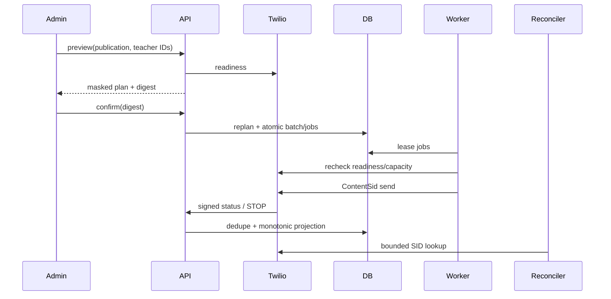

# Design: Official WhatsApp Billing Notifications

## Technical Approach

Replace synchronous sends with a billing outbox. Preview/confirmation rebuild an immutable `BillingPublicationRevision` plan; a worker performs provider I/O, while callbacks/reconciliation project outcomes. Sandbox stays separate.

## Architecture Decisions

| Decision | Choice and rationale | Rejected tradeoff |
|---|---|---|
| Persistence | Add `WhatsAppPreference` (teacher, E.164, verification/consent/opt-out evidence, revision), `BillingNotificationBatch` (publication/version/digest/readiness), `BillingNotificationJob` (recipient/channel/content/media snapshot, status/lease/attempts/SID), `WhatsAppEvent` (dedupe key, sanitized facts), and `BillingMediaToken` (token hash, artifact hash/path/size, binding, expiry/revocation). Unique digest and `(batch_id, teacher_ci, channel)` prevent duplicate intent. | `OutboundNotificationAttempt` lacks leases, consent snapshots, and events; retain for legacy/email audit. |
| Digest | SHA-256 canonical JSON: schema, publication ID/version/billing digest, sorted teacher IDs, preference revisions, channel/reason, Content SID, PDF SHA/size. Confirm replans transactionally, constant-time compares, and inserts all or none. | Client state becomes stale. |
| Leasing | PostgreSQL claims due rows with `FOR UPDATE SKIP LOCKED`, records owner/expiry, commits, then performs I/O. Immediately after lease and before create, the worker rechecks sender/template/capacity readiness; safe drift releases with backoff, fails closed, and never selects email. Expired pre-create leases requeue; post-create uncertainty becomes `ambiguous`, never a create retry. SQLite uses deterministic single-worker compare-and-set `UPDATE`; PostgreSQL tests prove concurrency. | Network I/O under locks causes contention. |
| Provider/capacity | `TwilioReadinessAdapter` fetches current sender status, Utility template approval, media throughput, quality, and portfolio moving unique-recipient limit. Preview shows cohort-versus-capacity forecast; confirmation fails closed if state is unavailable/exceeded. Worker throttles below observed media MPS and reserves/checks moving unique recipients before create. `TwilioContentAdapter` sends `ContentSid`, JSON `ContentVariables` (including the bound PDF URL), WhatsApp From/To, and `StatusCallback`; never `Body`/message-level `MediaUrl`. Restricted Key sends/reads; Auth Token verifies webhooks. | Cached/assumed capacity can overrun provider limits. |
| Outcomes | Store validated events idempotently; project `queued → accepted → sent → delivered → read`, with non-regressing terminal `failed/undelivered` branches. Accept `SM|MM` SIDs. Bounded lookup reconciles known SIDs; SID-less ambiguity requires operator review, never retry/email. Signed STOP records opt-out and cancels unleased jobs; unknown numbers never link. | Arrival order permits regression/duplicate fallback. |

## Sequence

## Interfaces and Security

- Admin: `POST /api/billing/notifications/preview`, `POST /api/billing/notifications/confirm`, `GET /api/billing/notifications/readiness`, `GET /api/billing/notifications/batches/{id}`. Preview masks E.164, classifies channels, and forecasts current capacity.
- Public: `POST /api/twilio/whatsapp/{status,inbound}`, `HEAD|GET /api/public/billing-media/{token}`. Twilio SDK validation uses configured canonical URL, actual query, and all raw form fields, never Host/forwarded headers.
- PDF generation reads only the immutable snapshot. Its token URL is bound to the approved Document-header `twilio/media` variable. Private storage retains files; the database stores token hashes. Repeatable HEAD/GET returns `application/pdf`, exact length, `no-store`, and inline filename matching `[A-Za-z0-9._-]{1,20}`; reject unbound, expired, revoked, or >15,000,000-byte artifacts without disclosure.
- `BillingChannelPolicy` selects email only for absent consent or a verified definite terminal WhatsApp failure. Readiness, stale digest, opt-out, blocked, pending, and ambiguous states never fall back.

## File Changes

| Area | Planned paths |
|---|---|
| Domain/data | `backend/app/models/{whatsapp_preference,billing_notification}.py`, `models/__init__.py`, `schemas/billing_notification.py`, `alembic/versions/*_official_whatsapp.py` |
| Services/process | `services/{billing_notification_service,billing_pdf_service,whatsapp_service,twilio_whatsapp_transport,whatsapp_webhook_service}.py`, `workers/billing_notification_worker.py` |
| HTTP/UI | `routers/{billing_publication,twilio_whatsapp,billing_media}.py`, `main.py`, `frontend/src/api/hooks/useBillingPublication.ts`, `pages/{PlanillaPage,PracticaPlanillaContent}.tsx` |
| Operations | `config.py`, `deploy/{compose.production.yml,.env.production.example}`, `deploy/nginx/app-nginx.conf`, backend/router/frontend tests |

## Testing and Threat Matrix

Unit RED tests cover digest, policy, transitions, STOP, signatures, media binding/filename/HEAD, and readiness. Router tests prove capacity forecast and rejection when capacity is unavailable/exceeded. PostgreSQL tests prove competing leases and atomic moving-recipient reservations. Worker-clock tests prove below-observed-MPS throttling, dispatch-time readiness drift requeue/no email, and no create above recipient limits. Adapter and frontend tests cover ambiguous outcomes and preview-confirm-status.

| Boundary | Applicability | Safe/failure behavior and planned RED test |
|---|---|---|
| Dedicated worker/container | Applicable | Only worker leases; flag-off exits, pre-create crashes recover, dispatch readiness drift backs off, and post-create uncertainty stays ambiguous. RED: two workers claim once; crash requeues; drift/timeout never email-falls-back or duplicates create. |
| Documentation-like paths | N/A | No executable classification. |
| Git repository selection | N/A | No VCS routing. |
| Commit state | N/A | No VCS mutation. |
| Push state | N/A | No push automation. |
| PR commands | N/A | No PR automation. |

## Migration / Rollout

Use additive tables, backfill no consent from legacy phones, and remove automatic sends. Flags `OFFICIAL_WHATSAPP_ENABLED`/`WHATSAPP_DISPATCH_ENABLED` default false. Deploy API plus one worker from the backend image with shared private-media volume; migrate, configure secrets/URLs, then validate sender/templates/limits and Advanced Opt-Out before a small cohort. External approvals are rollout prerequisites, not blockers. Rollback disables dispatch, stops worker, cancels unleased jobs, revokes tokens, and preserves audits. No unresolved questions.
