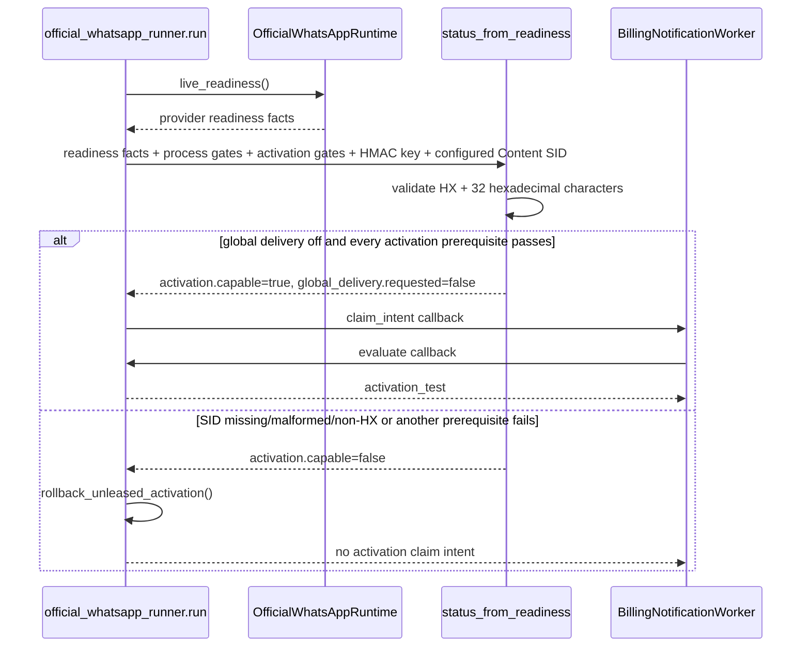

# Technical Design: Forward WhatsApp Worker Content Readiness

## Phase result contract

| Field | Result |
|---|---|
| Change | `fix-whatsapp-worker-content-readiness` |
| Phase | design |
| Status | ready for tasks/apply |
| Artifact | `openspec/changes/fix-whatsapp-worker-content-readiness/design.md` |
| Artifact store | OpenSpec |
| Execution mode | auto |
| Delivery strategy | ask-on-risk |
| Review budget | 400 changed lines |
| Expected product surface | Two files: one runtime argument and one focused regression test |
| Skill resolution | paths-injected (`cognitive-doc-design`) |
| Production/operator action | none; ordinary delivery and production state remain unchanged |

This design is grounded in the change proposal, exploration, delta specification, and current runner/readiness code. The correction is intentionally limited to forwarding one existing setting across one existing boundary and proving the resulting bounded claim selection.

## Decision

Add exactly one keyword argument to the existing `status_from_readiness()` call in `official_whatsapp_runner.run()`:

```python
configured_content_sid=settings.TWILIO_OFFICIAL_CONTENT_SID,
```

Do not change readiness calculation. `status_from_readiness()` remains the authority for validating the SID with `_configured_content_sid_is_valid()`, which accepts only `HX` followed by 32 hexadecimal characters. Its optional `configured_content_sid=None` default remains unchanged for compatibility with other callers and remains fail-closed.

Add one runner regression test that verifies both the exact boundary argument and its behavioral consequence: with global delivery off and activation readiness capable, `claim_intent()` returns `activation_test`, never `ordinary`.

## Runtime flow

The worker already reads all other activation prerequisites from `settings`. The missing SID is forwarded alongside those facts; no new state or abstraction is introduced.



This flow does not call transport merely because readiness becomes capable. Existing leasing and final activation authorization still gate any later provider call.

## File changes

| Path | Change |
|---|---|
| `backend/app/workers/official_whatsapp_runner.py` | Pass `settings.TWILIO_OFFICIAL_CONTENT_SID` as `configured_content_sid` in the existing readiness call. |
| `backend/tests/services/test_official_whatsapp_runner.py` | Add one mocked-cycle regression for exact SID forwarding and global-off `activation_test` intent. |

No other production or test files are required. If implementation reveals a need to change readiness logic, authorization, transport, deployment, or more than the narrow two-file surface, stop and reassess scope. Pause under `ask-on-risk` if the 400-line review budget becomes threatened.

## Contracts and compatibility

There are no schema, API, or configuration changes because all required contracts already exist:

- **Schema/persistence:** no value is stored or reshaped; the worker only passes an in-memory setting to an in-memory readiness function. No model or migration changes are needed.
- **API:** no request, response, route, or status projection changes. The readiness result shape and claim-intent values already support this behavior.
- **Configuration:** `TWILIO_OFFICIAL_CONTENT_SID` is already required by `OfficialWhatsAppRuntime.configuration_readiness()` and already consumed by runtime transport/live readiness. No environment key, default, deployment manifest, or runbook changes are needed.
- **Function signature:** `status_from_readiness(..., configured_content_sid: str | None = None)` already exists. Keeping the default preserves existing callers and their fail-closed behavior.
- **Ordinary delivery:** the ordinary branch still requires `global_delivery.requested`, `global_delivery.effective`, and ordinary readiness. Forwarding the SID cannot set the persisted global request or bypass those checks.

## Failure behavior

- Missing, malformed, or non-`HX` values remain invalid in `_configured_content_sid_is_valid()` and keep activation incapable.
- Any other failed activation prerequisite still keeps `activation.capable` false.
- An incapable activation status continues to invoke `rollback_unleased_activation()` and yields no activation claim intent.
- Runtime configuration failure still exits before the loop with status `2` after the existing activation sweep.
- Exceptions in a worker cycle retain the existing logged backoff behavior; this change adds no new exception path.
- Provider calls, final dispatch authorization, leasing, callbacks, and reconciliation remain untouched.

The delta specification's invalid-SID behavior is covered at the readiness-service boundary by the existing delivery-control tests. The new runner test stays focused on the wiring defect and valid bounded branch rather than duplicating SID-validation cases in the caller.

## Focused regression test

Add one test beside `test_runner_ordinary_dispatch_authorization_uses_effective_enabled`, using the same one-cycle pattern.

### Settings

Patch `app.config.settings` with the existing `settings()` helper plus:

```python
BILLING_WHATSAPP_ACTIVATION_API_ENABLED=True
BILLING_WHATSAPP_ACTIVATION_DISPATCH_ENABLED=True
WHATSAPP_RECIPIENT_HMAC_KEY="h" * 32
TWILIO_OFFICIAL_CONTENT_SID="HX" + "c" * 32
```

The existing helper keeps both process gates true. The readiness stub returns global delivery requested/effective false, so ordinary delivery is not selected.

### Exact mocks

- `runner.SessionLocal`: replace with a fake database having no-op `commit()` and `close()`.
- `runner.mark_worker_heartbeat`: replace with `lambda _db: None`.
- `runner.sweep_expired_activations`: replace with `lambda _db: 0`.
- `runner.OfficialWhatsAppRuntime.from_settings`: return a fake runtime whose `live_readiness()` returns `{"ready": True, "capacity": {"available": True}}`.
- `runner.status_from_readiness`: capture keyword arguments, assert `configured_content_sid` equals the exact patched SID, and return:

```python
{
    "readiness": {"ready": False},
    "effective_enabled": False,
    "global_delivery": {"requested": False, "effective": False},
    "activation": {"capable": True},
}
```

- `runner.BillingNotificationWorker`: capture the supplied `claim_intent`; in `process_one()`, assert it returns `"activation_test"`, then raise `KeyboardInterrupt`.
- `app.config.settings`: patch to the configured `SimpleNamespace` above.

Wrap `runner.run()` in `pytest.raises(KeyboardInterrupt)`. `KeyboardInterrupt` escapes the runner's `except Exception` block, terminating the otherwise infinite loop after one cycle while still exercising `finally: db.close()`.

This mocking prevents database queries, provider readiness HTTP, transport sends, sleeps, authorization consumption, and production mutation. Returning `activation.capable=True` also ensures `rollback_unleased_activation()` is not reached; the test fails before worker construction if the SID is not forwarded exactly.

## Verification

Run the caller regression and the authoritative readiness validation together:

```bash
cd backend
venv/bin/python -m pytest -q \
  tests/services/test_official_whatsapp_runner.py \
  tests/services/test_whatsapp_delivery_control.py
```

If `backend/venv` is unavailable, use the repository-local Python environment. The runner test proves forwarding and intent selection; delivery-control tests preserve missing, malformed, and non-`HX` fail-closed validation.

## Rollout and rollback

No deployment sequencing, configuration update, data migration, provider operation, or operator action is part of this change. Ship as a normal backend code correction only after focused tests pass. Existing gates remain authoritative, so deployment alone does not enable ordinary delivery or authorize an activation.

Rollback is a code revert of the one worker argument and its focused test. The worker then returns to the previous conservative defect: readiness receives `None`, activation remains incapable at this call site, released unleased activation work is rolled back, and no activation job is claimed. Reversion changes no persisted settings, jobs, authorizations, provider state, schema, API, deployment configuration, or runbook.
